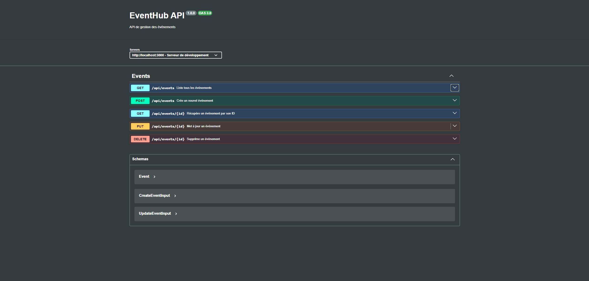
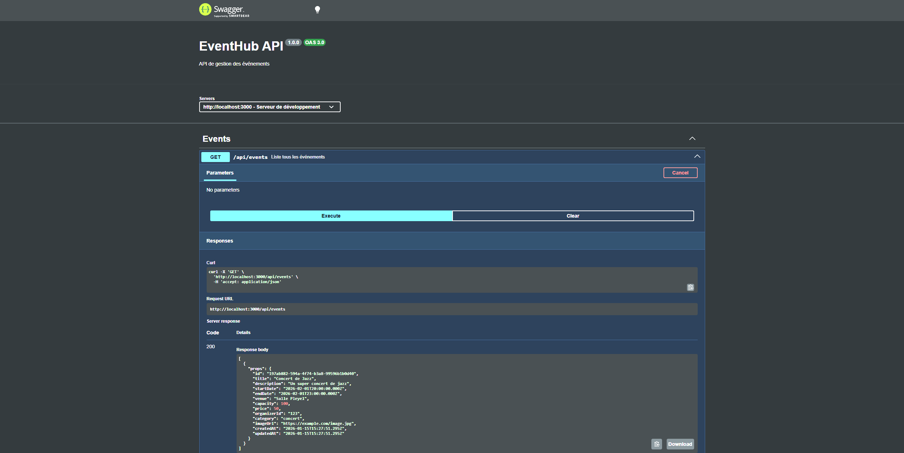
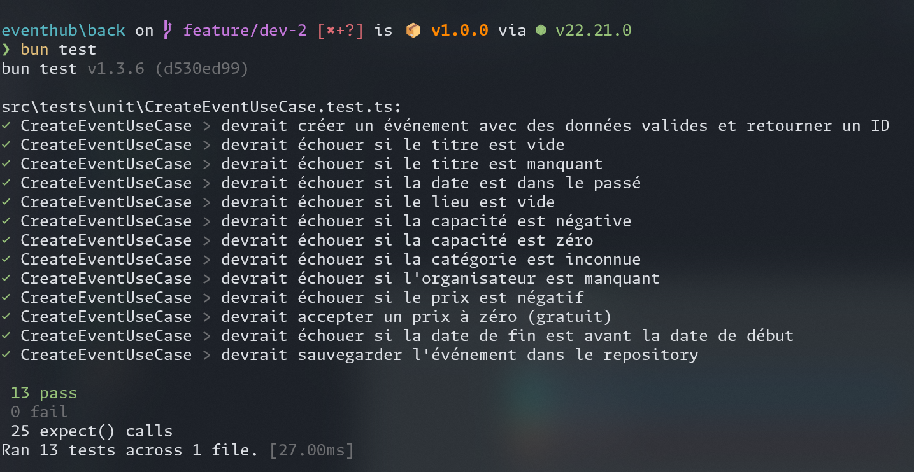

# EventHub Backend

## Gestion des événements

**Présentation technique - Semaine Backend (dev 2)**

---

# 1. Introduction

- **Application EventHub** : plateforme de gestion d'événements
- **Stack** : Bun + Express + Prisma + PostgreSQL
- **Objectif** : Implémenter la feature "Gestion des événements"
- **Approche** : Onion Architecture + SOLID + TDD

---

# 2. Architecture Onion

```
┌─────────────────────────────────────────┐
│  API         → Controllers, Routes      │
├─────────────────────────────────────────┤
│  Infrastructure → Repositories Prisma   │
├─────────────────────────────────────────┤
│  Application    → Use Cases             │
├─────────────────────────────────────────┤
│  Domain         → Entities, Interfaces  │
└─────────────────────────────────────────┘
```

---

# 3. Design Patterns

**Repository Pattern** - Découple domaine et BDD

```typescript
export interface EventRepositoryInterface {
    save(event: Event): Promise<Event>;
    findById(id: string): Promise<Event | null>;
    // ...
}
```

**Dependency Injection** - Testabilité

```typescript
const repository = new PrismaEventRepository(prisma);
const useCase = new CreateEventUseCase(repository);
```

---

# 4. Validation dans l'Entité

```typescript
export class Event {
    constructor(props: EventProps) {
        this.validate(props); // Validation au constructeur
        this.props = props;
    }

    private validate(props: EventProps): void {
        if (!props.title?.trim()) {
            throw new ValidationError("Le titre est obligatoire");
        }
        if (new Date(props.startDate) <= new Date()) {
            throw new ValidationError("Date doit être dans le futur");
        }
    }
}
```

---

# 5. API REST - Endpoints

| Méthode | Route             | Description               | Code |
| ------- | ----------------- | ------------------------- | ---- |
| GET     | `/api/events`     | Liste tous les événements | 200  |
| GET     | `/api/events/:id` | Récupère un événement     | 200  |
| POST    | `/api/events`     | Crée un événement         | 201  |
| PUT     | `/api/events/:id` | Met à jour un événement   | 200  |
| DELETE  | `/api/events/:id` | Supprime un événement     | 204  |

---

# 6. Documentation Swagger



---

# 7. Démonstration Swagger



---

# 8. Base de données

**Schéma Prisma** + **Seeds**

```prisma
model Event {
  id          String   @id @default(uuid())
  title       String
  startDate   DateTime
  venue       String
  capacity    Int
  category    String
  // ...
}
```

- **PrismaEventRepository** : Production
- **InMemoryEventRepository** : Tests

---

# 9. Flux d'une requête

```
POST /api/events
       ↓
EventController.create()
       ↓
CreateEventUseCase.execute()
       ↓
new Event() → validation
       ↓
EventRepository.save() → PostgreSQL
```

---

# 10. Tests - Résultats



---

# 11. Tests - Exemples

```typescript
it("devrait créer un événement avec des données valides", async () => {
    const result = await useCase.execute(validEventData);
    expect(result.id).toBeDefined();
});

it("devrait échouer si le titre est vide", async () => {
    await expect(useCase.execute({ ...validEventData, title: "" }))
        .rejects.toThrow(ValidationError);
});
```

**13 tests** couvrant toutes les règles métier

---

# 12. Conclusion

## Compétences acquises

- Onion Architecture, Repository Pattern, DI
- API REST avec Express + Swagger
- TDD avec 13 tests

## Difficultés

- Configuration Docker/Prisma

## Améliorations

- Authentification JWT, Pagination, Tests d'intégration

---

# Merci !
