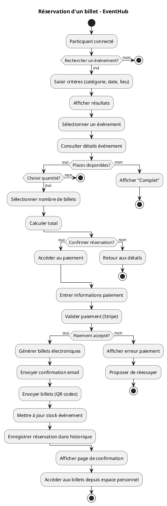

# Diagramme d'activité - Réservation d'un billet

A copier/coller sur https://www.plantuml.com/plantuml

```plantuml
@startuml
title Réservation d'un billet - EventHub

start

:Participant connecté;

if (Rechercher un événement?) then (oui)
  :Saisir critères (catégorie, date, lieu);
  :Afficher résultats;
  :Sélectionner un événement;
else (non)
  stop
endif

:Consulter détails événement;
if (Places disponibles?) then (oui)
  if (Choisir quantité?) then (oui)
    :Sélectionner nombre de billets;
    :Calculer total;
  else (non)
    stop
  endif
else (non)
  :Afficher "Complet";
  stop
endif

if (Confirmer réservation?) then (oui)
  :Accéder au paiement;
else (non)
  :Retour aux détails;
  stop
endif

:Entrer informations paiement;
:Valider paiement (Stripe);
if (Paiement accepté?) then (oui)
  :Générer billets électroniques;
  :Envoyer confirmation email;
  :Envoyer billets (QR codes);
  :Mettre à jour stock événement;
  :Enregistrer réservation dans historique;
else (non)
  :Afficher erreur paiement;
  :Proposer de réessayer;
  stop
endif

:Afficher page de confirmation;
:Accéder aux billets depuis espace personnel;

stop

@enduml
```
