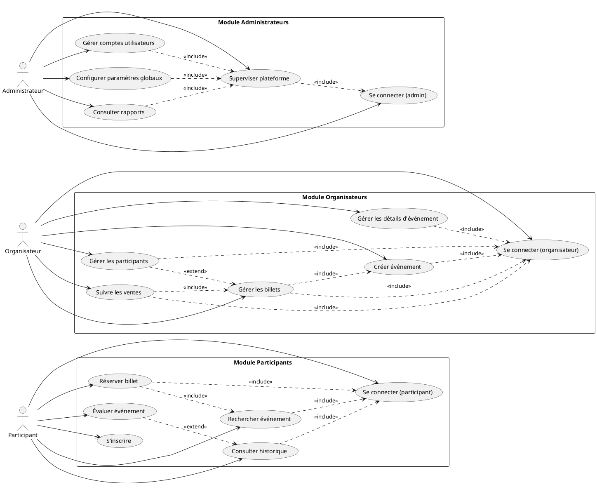

# Diagramme de cas d'utilisation - Participants & Organisateurs

```plantuml
@startuml
left to right direction
skinparam packageStyle rectangle

actor "Participant" as Participant
actor "Organisateur" as Organisateur
actor "Administrateur" as Administrateur

rectangle "Module Participants" {
  usecase "S'inscrire" as UCRegister
  usecase "Se connecter (participant)" as UCLoginParticipant
  usecase "Rechercher événement" as UCSearch
  usecase "Réserver billet" as UCBook
  usecase "Consulter historique" as UCHistory
  usecase "Évaluer événement" as UCRate
}

rectangle "Module Organisateurs" {
  usecase "Se connecter (organisateur)" as UCLoginOrganizer
  usecase "Créer événement" as UCCreate
  usecase "Gérer les détails d'événement" as UCManageDetails
  usecase "Gérer les billets" as UCTickets
  usecase "Suivre les ventes" as UCSales
  usecase "Gérer les participants" as UCManageParticipants
}

rectangle "Module Administrateurs" {
  usecase "Se connecter (admin)" as UCLoginAdmin
  usecase "Superviser plateforme" as UCSupervise
  usecase "Gérer comptes utilisateurs" as UCManageAccounts
  usecase "Configurer paramètres globaux" as UCConfigure
  usecase "Consulter rapports" as UCReports
}

Participant --> UCRegister
Participant --> UCLoginParticipant
Participant --> UCSearch
Participant --> UCBook
Participant --> UCHistory
Participant --> UCRate

Organisateur --> UCLoginOrganizer
Organisateur --> UCCreate
Organisateur --> UCManageDetails
Organisateur --> UCTickets
Organisateur --> UCSales
Organisateur --> UCManageParticipants

Administrateur --> UCLoginAdmin
Administrateur --> UCSupervise
Administrateur --> UCManageAccounts
Administrateur --> UCConfigure
Administrateur --> UCReports

UCBook ..> UCLoginParticipant : <<include>>
UCBook ..> UCSearch : <<include>>
UCHistory ..> UCLoginParticipant : <<include>>
UCRate ..> UCHistory : <<extend>>
UCSearch ..> UCLoginParticipant : <<include>>

UCCreate ..> UCLoginOrganizer : <<include>>
UCManageDetails ..> UCLoginOrganizer : <<include>>
UCTickets ..> UCLoginOrganizer : <<include>>
UCManageParticipants ..> UCLoginOrganizer : <<include>>
UCSales ..> UCLoginOrganizer : <<include>>

UCTickets ..> UCCreate : <<include>>
UCManageParticipants ..> UCTickets : <<extend>>
UCSales ..> UCTickets : <<include>>

UCSupervise ..> UCLoginAdmin : <<include>>
UCManageAccounts ..> UCSupervise : <<include>>
UCConfigure ..> UCSupervise : <<include>>
UCReports ..> UCSupervise : <<include>>
@enduml
```
