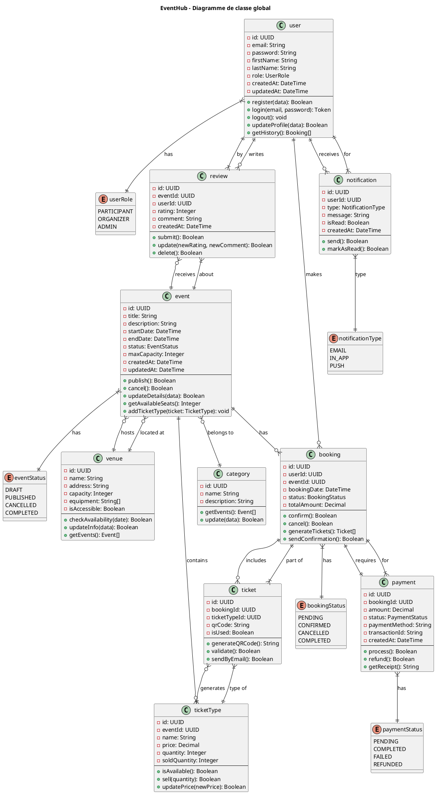

# Diagramme de classe - EventHub (Global)

A copier/coller sur https://www.plantuml.com/plantuml

```plantuml
@startuml
title EventHub - Diagramme de classe global

' --- Utilisateurs ---
class user {
  -id: UUID
  -email: String
  -password: String
  -firstName: String
  -lastName: String
  -role: UserRole
  -createdAt: DateTime
  -updatedAt: DateTime
  --
  +register(data): Boolean
  +login(email, password): Token
  +logout(): void
  +updateProfile(data): Boolean
  +getHistory(): Booking[]
}

enum userRole {
  PARTICIPANT
  ORGANIZER
  ADMIN
}

' --- Événements ---
class event {
  -id: UUID
  -title: String
  -description: String
  -startDate: DateTime
  -endDate: DateTime
  -status: EventStatus
  -maxCapacity: Integer
  -createdAt: DateTime
  -updatedAt: DateTime
  --
  +publish(): Boolean
  +cancel(): Boolean
  +updateDetails(data): Boolean
  +getAvailableSeats(): Integer
  +addTicketType(ticket: TicketType): void
}

enum eventStatus {
  DRAFT
  PUBLISHED
  CANCELLED
  COMPLETED
}

' --- Lieux ---
class venue {
  -id: UUID
  -name: String
  -address: String
  -capacity: Integer
  -equipment: String[]
  -isAccessible: Boolean
  --
  +checkAvailability(date): Boolean
  +updateInfo(data): Boolean
  +getEvents(): Event[]
}

' --- Types de billets ---
class ticketType {
  -id: UUID
  -eventId: UUID
  -name: String
  -price: Decimal
  -quantity: Integer
  -soldQuantity: Integer
  --
  +isAvailable(): Boolean
  +sell(quantity): Boolean
  +updatePrice(newPrice): Boolean
}

' --- Réservations ---
class booking {
  -id: UUID
  -userId: UUID
  -eventId: UUID
  -bookingDate: DateTime
  -status: BookingStatus
  -totalAmount: Decimal
  --
  +confirm(): Boolean
  +cancel(): Boolean
  +generateTickets(): Ticket[]
  +sendConfirmation(): Boolean
}

enum bookingStatus {
  PENDING
  CONFIRMED
  CANCELLED
  COMPLETED
}

' --- Billets ---
class ticket {
  -id: UUID
  -bookingId: UUID
  -ticketTypeId: UUID
  -qrCode: String
  -isUsed: Boolean
  --
  +generateQRCode(): String
  +validate(): Boolean
  +sendByEmail(): Boolean
}

' --- Évaluations ---
class review {
  -id: UUID
  -eventId: UUID
  -userId: UUID
  -rating: Integer
  -comment: String
  -createdAt: DateTime
  --
  +submit(): Boolean
  +update(newRating, newComment): Boolean
  +delete(): Boolean
}

' --- Catégories ---
class category {
  -id: UUID
  -name: String
  -description: String
  --
  +getEvents(): Event[]
  +update(data): Boolean
}

' --- Notifications ---
class notification {
  -id: UUID
  -userId: UUID
  -type: NotificationType
  -message: String
  -isRead: Boolean
  -createdAt: DateTime
  --
  +send(): Boolean
  +markAsRead(): Boolean
}

enum notificationType {
  EMAIL
  IN_APP
  PUSH
}

' --- Paiements ---
class payment {
  -id: UUID
  -bookingId: UUID
  -amount: Decimal
  -status: PaymentStatus
  -paymentMethod: String
  -transactionId: String
  -createdAt: DateTime
  --
  +process(): Boolean
  +refund(): Boolean
  +getReceipt(): String
}

enum paymentStatus {
  PENDING
  COMPLETED
  FAILED
  REFUNDED
}

' --- Relations ---
user ||--o{ booking : makes
user ||--o{ review : writes
user ||--o{ notification : receives
user }|--|| userRole : has

event ||--o{ ticketType : contains
event ||--o{ booking : has
event ||--o{ review : receives
event }|--|| eventStatus : has
event }o--|| venue : located at
event }o--|| category : belongs to

venue ||--o{ event : hosts

ticketType ||--o{ ticket : generates

booking ||--o{ ticket : includes
booking ||--|| payment : requires
booking }|--|| bookingStatus : has

ticket }|--|| ticketType : type of
ticket }|--|| booking : part of

review }|--|| event : about
review }|--|| user : by

notification }|--|| user : for
notification }|--|| notificationType : type

payment }|--|| booking : for
payment }|--|| paymentStatus : has

@enduml
```
