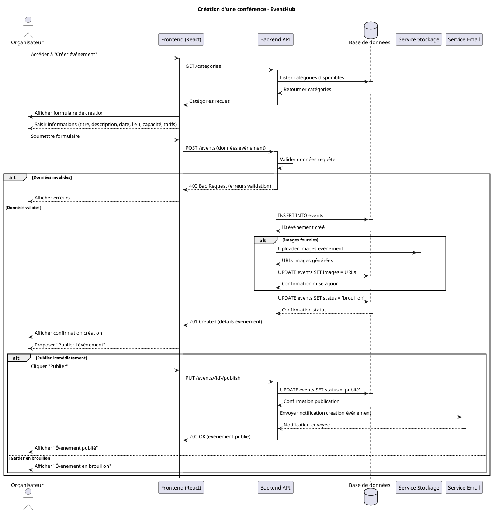

# Diagramme de séquence - Création d'une conférence

A copier/coller sur https://www.plantuml.com/plantuml

```plantuml
@startuml
title Création d'une conférence - EventHub

actor "Organisateur" as Org
participant "Frontend (React)" as UI
participant "Backend API" as API
database "Base de données" as DB
participant "Service Stockage" as Storage
participant "Service Email" as Email

Org -> UI: Accéder à "Créer événement"
activate UI

UI -> API: GET /categories
activate API
API -> DB: Lister catégories disponibles
activate DB
DB --> API: Retourner catégories
deactivate DB
API --> UI: Catégories reçues
deactivate API

UI -> Org: Afficher formulaire de création
UI --> Org: Saisir informations (titre, description, date, lieu, capacité, tarifs)

Org -> UI: Soumettre formulaire
UI -> API: POST /events (données événement)
activate API

API -> API: Valider données requête
alt Données invalides
  API --> UI: 400 Bad Request (erreurs validation)
  deactivate API
  UI --> Org: Afficher erreurs
else Données valides
  API -> DB: INSERT INTO events
  activate DB
  DB --> API: ID événement créé
  deactivate DB
  
  alt Images fournies
    API -> Storage: Uploader images événement
    activate Storage
    Storage --> API: URLs images générées
    deactivate Storage
    API -> DB: UPDATE events SET images = URLs
    activate DB
    DB --> API: Confirmation mise à jour
    deactivate DB
  end
  
  API -> DB: UPDATE events SET status = 'brouillon'
  activate DB
  DB --> API: Confirmation statut
  deactivate DB
  
  API --> UI: 201 Created (détails événement)
  deactivate API
  
  UI --> Org: Afficher confirmation création
  UI --> Org: Proposer "Publier l'événement"
  
  alt Publier immédiatement
    Org -> UI: Cliquer "Publier"
    UI -> API: PUT /events/{id}/publish
    activate API
    API -> DB: UPDATE events SET status = 'publié'
    activate DB
    DB --> API: Confirmation publication
    deactivate DB
    API -> Email: Envoyer notification création événement
    activate Email
    Email --> API: Notification envoyée
    deactivate Email
    API --> UI: 200 OK (événement publié)
    deactivate API
    UI --> Org: Afficher "Événement publié"
  else Garder en brouillon
    UI --> Org: Afficher "Événement en brouillon"
  end
end

deactivate UI

@enduml
```
