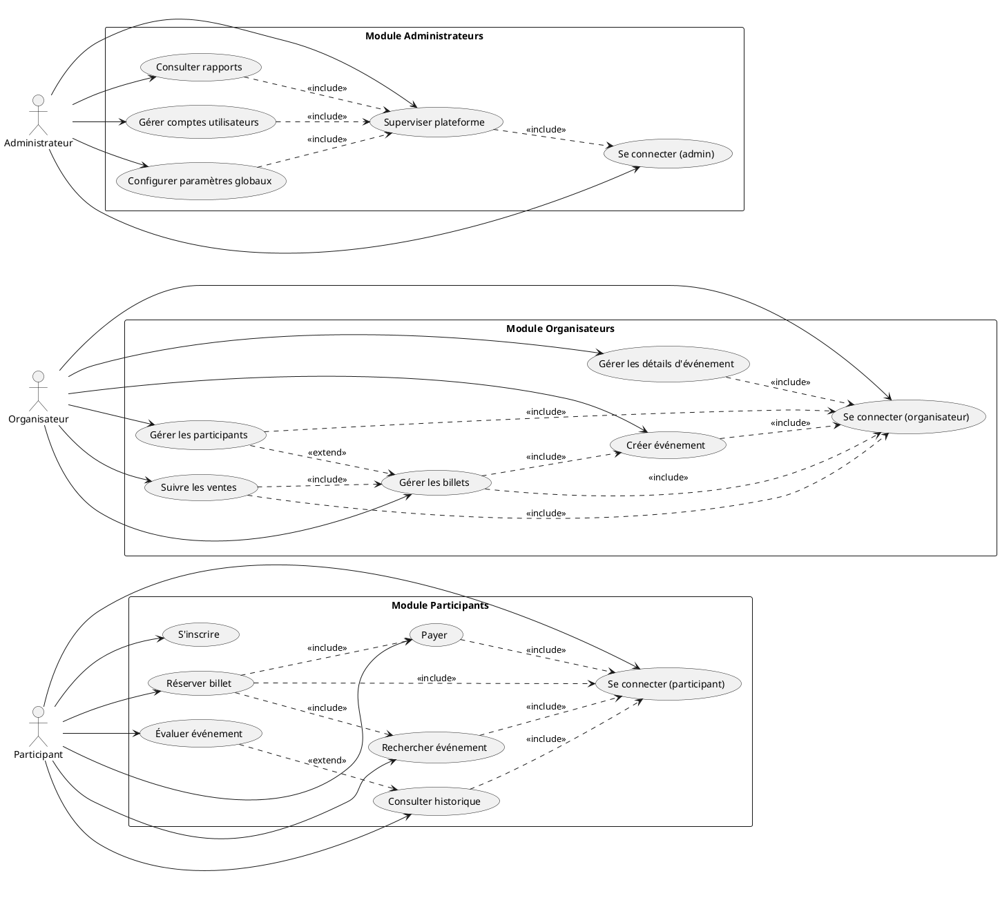
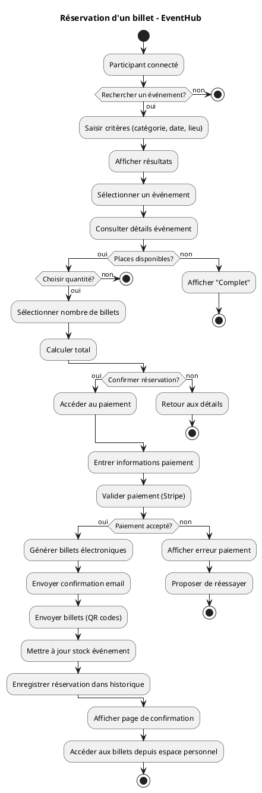
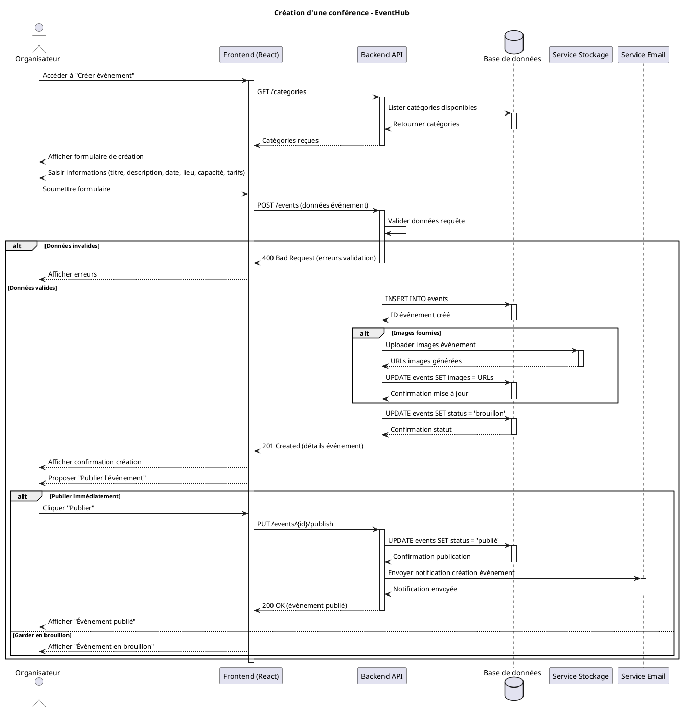
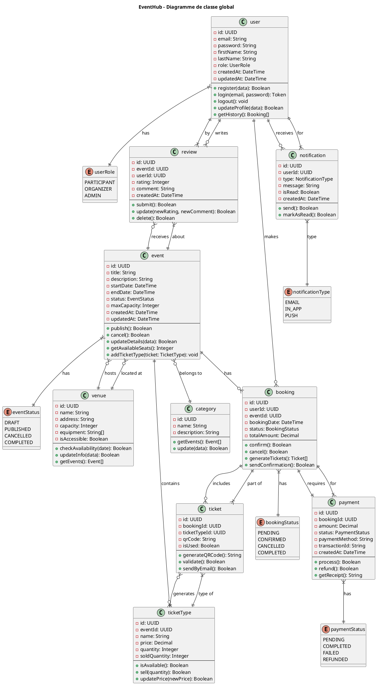
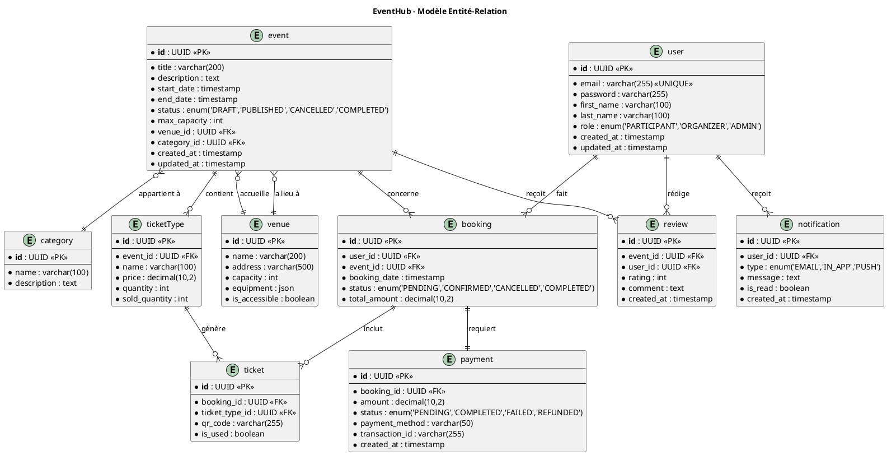

# EventHub - Diagrammes Complets

Ce fichier contient tous les diagrammes UML du projet EventHub. Pour visualiser un diagramme, copiez le code PlantUML correspondant et collez-le sur https://www.plantuml.com/plantuml

---

## 1. Diagramme de cas d'utilisation - Participants, Organisateurs et Administrateurs

A copier/coller sur https://www.plantuml.com/plantuml



---

## 2. Diagramme d'activité - Réservation d'un billet

A copier/coller sur https://www.plantuml.com/plantuml



---

## 3. Diagramme de séquence - Création d'une conférence

A copier/coller sur https://www.plantuml.com/plantuml



---

## 4. Diagramme de classe - EventHub (Global)

A copier/coller sur https://www.plantuml.com/plantuml



---

## 5. Modèle Entité-Relation - EventHub

A copier/coller sur https://www.plantuml.com/plantuml



---

## Instructions d'utilisation

1. **Choisir un diagramme** ci-dessus
2. **Copier** le code PlantUML correspondant (entre les ```plantuml et ```)
3. **Coller** le code sur https://www.plantuml.com/plantuml
4. Le diagramme s'affichera automatiquement

### Types de diagrammes utilisés

- **Diagramme de cas d'utilisation** : Montre les interactions entre les acteurs et le système
- **Diagramme d'activité** : Représente le flux d'un processus métier
- **Diagramme de séquence** : Illustre les interactions temporelles entre composants
- **Diagramme de classe** : Modélise la structure orientée objet avec attributs et méthodes
- **Modèle entité-relation** : Schéma de base de données avec entités et relations
