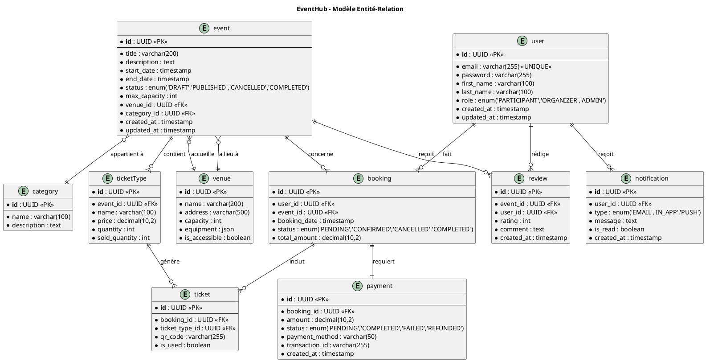

# Modèle Entité-Relation - EventHub

A copier/coller sur https://www.plantuml.com/plantuml

```plantuml
@startuml
title EventHub - Modèle Entité-Relation

' --- Entité Utilisateur ---
entity user {
  * **id** : UUID <<PK>>
  --
  * email : varchar(255) <<UNIQUE>>
  * password : varchar(255)
  * first_name : varchar(100)
  * last_name : varchar(100)
  * role : enum('PARTICIPANT','ORGANIZER','ADMIN')
  * created_at : timestamp
  * updated_at : timestamp
}

' --- Entité Événement ---
entity event {
  * **id** : UUID <<PK>>
  --
  * title : varchar(200)
  * description : text
  * start_date : timestamp
  * end_date : timestamp
  * status : enum('DRAFT','PUBLISHED','CANCELLED','COMPLETED')
  * max_capacity : int
  * venue_id : UUID <<FK>>
  * category_id : UUID <<FK>>
  * created_at : timestamp
  * updated_at : timestamp
}

' --- Entité Lieu ---
entity venue {
  * **id** : UUID <<PK>>
  --
  * name : varchar(200)
  * address : varchar(500)
  * capacity : int
  * equipment : json
  * is_accessible : boolean
}

' --- Entité Catégorie ---
entity category {
  * **id** : UUID <<PK>>
  --
  * name : varchar(100)
  * description : text
}

' --- Entité Type de Billet ---
entity ticketType {
  * **id** : UUID <<PK>>
  --
  * event_id : UUID <<FK>>
  * name : varchar(100)
  * price : decimal(10,2)
  * quantity : int
  * sold_quantity : int
}

' --- Entité Réservation ---
entity booking {
  * **id** : UUID <<PK>>
  --
  * user_id : UUID <<FK>>
  * event_id : UUID <<FK>>
  * booking_date : timestamp
  * status : enum('PENDING','CONFIRMED','CANCELLED','COMPLETED')
  * total_amount : decimal(10,2)
}

' --- Entité Billet ---
entity ticket {
  * **id** : UUID <<PK>>
  --
  * booking_id : UUID <<FK>>
  * ticket_type_id : UUID <<FK>>
  * qr_code : varchar(255)
  * is_used : boolean
}

' --- Entité Évaluation ---
entity review {
  * **id** : UUID <<PK>>
  --
  * event_id : UUID <<FK>>
  * user_id : UUID <<FK>>
  * rating : int
  * comment : text
  * created_at : timestamp
}

' --- Entité Notification ---
entity notification {
  * **id** : UUID <<PK>>
  --
  * user_id : UUID <<FK>>
  * type : enum('EMAIL','IN_APP','PUSH')
  * message : text
  * is_read : boolean
  * created_at : timestamp
}

' --- Entité Paiement ---
entity payment {
  * **id** : UUID <<PK>>
  --
  * booking_id : UUID <<FK>>
  * amount : decimal(10,2)
  * status : enum('PENDING','COMPLETED','FAILED','REFUNDED')
  * payment_method : varchar(50)
  * transaction_id : varchar(255)
  * created_at : timestamp
}

' --- Relations ---
user ||--o{ booking : "fait"
user ||--o{ review : "rédige"
user ||--o{ notification : "reçoit"

event ||--o{ ticketType : "contient"
event ||--o{ booking : "concerne"
event ||--o{ review : "reçoit"
event }o--|| venue : "a lieu à"
event }o--|| category : "appartient à"

venue ||--o{ event : "accueille"

ticketType ||--o{ ticket : "génère"

booking ||--o{ ticket : "inclut"
booking ||--|| payment : "requiert"

@enduml
```
